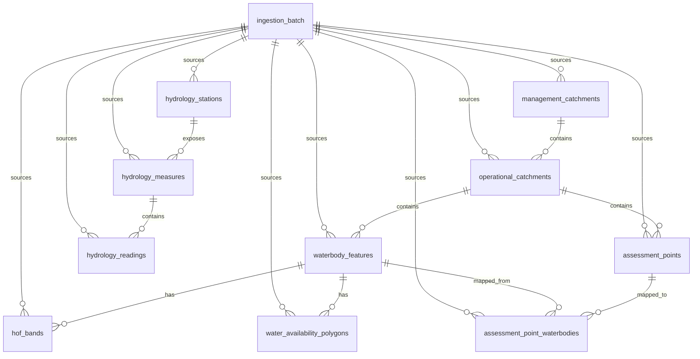

# DDSP Data Dictionary

Data dictionary for the PostGIS schema in [`ddsp-schema-design.sql`](./ddsp-schema-design.sql) and
migrations [`202609080001-create-assessment-point-tables.js`](../migrations/202609080001-create-assessment-point-tables.js),
[`202609171001-create-hydrology-tables.js`](../migrations/202609171001-create-hydrology-tables.js), and
[`202609171002-add-domain-check-constraints.js`](../migrations/202609171002-add-domain-check-constraints.js).
Covers all 11 tables currently in scope. This is the WRWA-301 ticket deliverable: table/column/type/
nullability plus source-field mapping back to the DDSP API response.

**Ground truth policy**: every field name below was confirmed against a live DDSP API/WFS response,
or against the applied migrations.

## SRID decision

All geometry columns are stored as **EPSG:4326 (WGS84)**. Source CRS is recorded per row
(`source_srid`) for traceability, and transforms are applied at ingestion time, not at query time:

| Source                                                                      | Native CRS (live-confirmed) | Transform needed                              |
| --------------------------------------------------------------------------- | --------------------------- | --------------------------------------------- |
| Catchment Planning API (WaterBody/OperationalCatchment/ManagementCatchment) | EPSG:4326                   | None                                          |
| Water Resource Availability WFS (`Resource_Availability_at_Q95`)            | EPSG:27700                  | `ST_Transform(ST_SetSRID(geom, 27700), 4326)` |
| Hydrology API (station lat/long)                                            | EPSG:4326                   | None (easting/northing kept as supplied, BNG) |
| CAMS Assessment Points (OGC Features)                                       | EPSG:4326                   | None                                          |

Runtime distance/area calculations should cast to `geography` (e.g. `geom::geography`) rather than
relying on planar units.

---

## `ingestion_batch`

Audit trail for every aggregator ingestion run, one row per source per run. Not itself DDSP-sourced.

| Column         | Type         | Nullable | Source field mapping                                                                                                     |
| -------------- | ------------ | -------- | ------------------------------------------------------------------------------------------------------------------------ |
| id             | serial (PK)  | no       | generated                                                                                                                |
| source_name    | varchar(100) | no       | aggregator-assigned: `catchment-planning-api` \| `water-availability-wfs` \| `hydrology-api` \| `cams-assessment-points` |
| source_version | varchar(100) | yes      | aggregator-assigned (e.g. source dataset/API version if exposed)                                                         |
| started_at     | timestamptz  | no       | aggregator run start time                                                                                                |
| finished_at    | timestamptz  | yes      | aggregator run end time                                                                                                  |
| row_count      | integer      | yes      | aggregator-computed                                                                                                      |
| status         | varchar(20)  | no       | aggregator-assigned: `running` \| `succeeded` \| `failed` (DB `CHECK` constraint enforces this set)                      |

---

## `management_catchments`

Source: Catchment Planning API `/ManagementCatchment/{id}.geojson`. Live-confirmed 2026-09-17:
this is a FeatureCollection of constituent waterbody features, not a dedicated management
catchment feature.

| Column                  | Type                     | Nullable              | Source field mapping                                                                                                                      |
| ----------------------- | ------------------------ | --------------------- | ----------------------------------------------------------------------------------------------------------------------------------------- |
| id                      | serial (PK)              | no                    | generated                                                                                                                                 |
| management_catchment_id | varchar(100)             | no                    | requested `ManagementCatchment/{id}` resource URL; not emitted in the GeoJSON payload                                                     |
| name                    | varchar(255)             | yes                   | not exposed as a machine-readable field by this endpoint; leave NULL until an authoritative structured source is identified               |
| water_type              | varchar(20)              | no, default `surface` | not a source field - groundwater is on hold, always `surface` for now (DB `CHECK` constraint limits values to `surface` \| `groundwater`) |
| river_basin_district    | varchar(255)             | yes                   | GeoJSON `properties.river_basin_district` (name resolved via linked River Basin District resource)                                        |
| geom                    | geometry(Geometry, 4326) | no                    | derived `ST_UnaryUnion` of constituent GeoJSON features whose `properties["geometry-type"]` is `.../Catchment` (native WGS84)             |
| properties              | jsonb                    | yes                   | full raw GeoJSON `properties` block, for fields not yet promoted to columns                                                               |
| ingestion_batch_id      | integer (FK)             | yes                   | aggregator-assigned                                                                                                                       |
| source_updated_at       | timestamptz              | yes                   | not currently exposed by this endpoint - populate once confirmed                                                                          |
| created_at / updated_at | timestamptz              | no                    | generated                                                                                                                                 |

Live sample: `ManagementCatchment/3012.geojson` returned 69 features, each with waterbody
`properties` keys `{id, name, uri, water-body-type, geometry-type}`. It has no top-level
properties and no management-catchment feature/name. The requested URL provides the stable
management-catchment ID; the resource HTML does not provide a reliable machine-readable name.

---

## `operational_catchments`

Source: Catchment Planning API `/OperationalCatchment/{id}.geojson`. Live-confirmed 2026-09-17:
this is a FeatureCollection of constituent waterbody features, not a dedicated operational
catchment feature.

| Column                   | Type                     | Nullable | Source field mapping                                                                                                                                              |
| ------------------------ | ------------------------ | -------- | ----------------------------------------------------------------------------------------------------------------------------------------------------------------- |
| id                       | serial (PK)              | no       | generated                                                                                                                                                         |
| operational_catchment_id | varchar(100)             | no       | requested `OperationalCatchment/{id}` resource URL; not emitted in the GeoJSON payload                                                                            |
| name                     | varchar(255)             | yes      | not exposed as a machine-readable field by this endpoint; leave NULL until an authoritative structured source is identified                                       |
| management_catchment_id  | integer (FK)             | yes      | resolved from the WaterBody detail page's `ManagementCatchment/{id}` link (live-confirmed pattern, e.g. `OperationalCatchment/3079` → `ManagementCatchment/3012`) |
| geom                     | geometry(Geometry, 4326) | no       | derived `ST_UnaryUnion` of constituent GeoJSON features whose `properties["geometry-type"]` is `.../Catchment` (native WGS84)                                     |
| properties               | jsonb                    | yes      | full raw GeoJSON `properties` block                                                                                                                               |
| ingestion_batch_id       | integer (FK)             | yes      | aggregator-assigned                                                                                                                                               |
| source_updated_at        | timestamptz              | yes      | not currently exposed by this endpoint                                                                                                                            |
| created_at / updated_at  | timestamptz              | no       | generated                                                                                                                                                         |

Live sample: `OperationalCatchment/3079.geojson` returned 47 features, each with waterbody
`properties` keys `{id, name, uri, water-body-type, geometry-type}`. It has no top-level
properties and no operational-catchment feature/name. The requested URL provides the stable
operational-catchment ID; the resource HTML does not provide a reliable machine-readable name.

---

## `waterbody_features`

Source: Catchment Planning API `/WaterBody/{id}.geojson`.

| Column                   | Type                     | Nullable              | Source field mapping                                                                                            |
| ------------------------ | ------------------------ | --------------------- | --------------------------------------------------------------------------------------------------------------- |
| id                       | serial (PK)              | no                    | generated                                                                                                       |
| waterbody_id             | varchar(100)             | no                    | GeoJSON `properties.id` (e.g. `"GB106039029800"`)                                                               |
| name                     | varchar(255)             | yes                   | GeoJSON `properties.name`                                                                                       |
| water_body_type          | varchar(50)              | yes                   | GeoJSON `properties["water-body-type"].string` (nested object `{string, lang}`, e.g. `"River"`, `"Lake"`)       |
| water_type               | varchar(20)              | no, default `surface` | not a source field - groundwater is on hold (DB `CHECK` constraint limits values to `surface` \| `groundwater`) |
| operational_catchment_id | integer (FK)             | yes                   | resolved from the WaterBody detail page's `OperationalCatchment/{id}` link                                      |
| geom                     | geometry(Geometry, 4326) | no                    | GeoJSON geometry (native WGS84)                                                                                 |
| properties               | jsonb                    | yes                   | full raw GeoJSON `properties` block, including `uri`, `geometry-type`                                           |
| ingestion_batch_id       | integer (FK)             | yes                   | aggregator-assigned                                                                                             |
| source_updated_at        | timestamptz              | yes                   | not currently exposed by this endpoint                                                                          |
| created_at / updated_at  | timestamptz              | no                    | generated                                                                                                       |

Live-confirmed (2026-09-10): each `WaterBody/{id}.geojson` response is a FeatureCollection with
**two features per waterbody** - a `Polygon` (catchment area, `geometry-type` =
`.../def/geometry/Catchment`) and a `MultiLineString` (river centreline, `geometry-type` =
`.../def/geometry/RiverLine`) - both share the same `id`/`name`/`water-body-type`. Ingestion should
decide which feature(s) to persist as `geom` (recommend the `Catchment` polygon for area/
containment queries) and retain the other in `properties` if needed.

---

## `water_availability_polygons`

Source: Water Resource Availability WFS (`Resource_Availability_at_Q95`). This layer supplies the
coarse, catchment-level Q30/50/70/95 availability classification; it is not a source for precise
Hands-off Flow bands/thresholds - see `hof_bands` below for that data.

| Column                  | Type                     | Nullable          | Source field mapping                                                                                                                              |
| ----------------------- | ------------------------ | ----------------- | ------------------------------------------------------------------------------------------------------------------------------------------------- |
| id                      | serial (PK)              | no                | generated                                                                                                                                         |
| ea_wb_id                | varchar(255)             | no                | WFS `properties.ea_wb_id` — links to `waterbody_features.waterbody_id`                                                                            |
| camscdsq30              | varchar(255)             | yes               | WFS `properties.camscdsq30` (colour word, e.g. `"Green"`)                                                                                         |
| camscdsq50              | varchar(255)             | yes               | WFS `properties.camscdsq50`                                                                                                                       |
| camscdsq70              | varchar(255)             | yes               | WFS `properties.camscdsq70`                                                                                                                       |
| camscdsq95              | varchar(255)             | yes               | WFS `properties.camscdsq95`                                                                                                                       |
| resavail                | varchar(255)             | yes               | WFS `properties.resavail` (free text, e.g. `"at least 70%"`, not an enum)                                                                         |
| shape_area              | double precision         | yes               | WFS `properties.shape_area` - **not present on every live feature** (absent from the live sample fetched 2026-09-10, which had `shape_leng` only) |
| shape_leng              | double precision         | yes               | WFS `properties.shape_leng`                                                                                                                       |
| geom                    | geometry(Geometry, 4326) | no                | WFS geometry, transformed from native EPSG:27700 at ingestion                                                                                     |
| source_srid             | integer                  | no, default 27700 | recorded for traceability (live-confirmed native CRS)                                                                                             |
| properties              | jsonb                    | yes               | full raw WFS `properties` block, including `country` (not yet promoted to a column)                                                               |
| ingestion_batch_id      | integer (FK)             | yes               | aggregator-assigned                                                                                                                               |
| source_updated_at       | timestamptz              | yes               | not currently exposed by this WFS layer                                                                                                           |
| created_at / updated_at | timestamptz              | no                | generated                                                                                                                                         |

Live-confirmed (2026-09-10) via
`GetFeature&TYPENAME=Resource_Availability_at_Q95&OUTPUTFORMAT=application/json`: response CRS is
`urn:ogc:def:crs:EPSG::27700`; real sample properties were exactly
`{ea_wb_id, shape_leng, country, camscdsq30, camscdsq50, camscdsq70, camscdsq95, resavail}` — no
`shape_area` key on that feature. Treat `shape_area` as optional/best-effort, not a reliable column
to depend on downstream.

---

## `hydrology_stations`

Source: Hydrology API `/hydrology/id/stations`.

| Column                  | Type                  | Nullable | Source field mapping                                                                                                              |
| ----------------------- | --------------------- | -------- | --------------------------------------------------------------------------------------------------------------------------------- |
| id                      | serial (PK)           | no       | generated                                                                                                                         |
| station_id              | varchar(100)          | no       | `stationGuid` (SUID; `notation` if not disambiguated)                                                                             |
| wiski_id                | varchar(100)          | yes      | `wiskiID`                                                                                                                         |
| nrfa_station_id         | varchar(100)          | yes      | `nrfaStationID` (present on some stations only, e.g. absent on "Ulting Sarasota" in the live sample)                              |
| name                    | varchar(255)          | yes      | `label`                                                                                                                           |
| easting                 | integer               | yes      | `easting` (BNG, as supplied)                                                                                                      |
| northing                | integer               | yes      | `northing` (BNG, as supplied)                                                                                                     |
| geom                    | geometry(Point, 4326) | no       | built from `lat`/`long` (native WGS84, no transform)                                                                              |
| properties              | jsonb                 | yes      | full raw item, including `riverName`, `dateOpened`, `catchmentArea`, `RLOIid`, `stationReference`, `dataQualityMessage`, `status` |
| ingestion_batch_id      | integer (FK)          | yes      | aggregator-assigned                                                                                                               |
| source_updated_at       | timestamptz           | yes      | not currently exposed by this endpoint                                                                                            |
| created_at / updated_at | timestamptz           | no       | generated                                                                                                                         |

Live-confirmed (2026-09-10) via `/hydrology/id/stations?_limit=2`: real fields include `label`,
`notation`, `easting`, `northing`, `lat`, `long`, `riverName`, `stationGuid`, `wiskiID`,
`dateOpened`, and (station-dependent) `nrfaStationID`, `nrfaStationURL`, `RLOIid`,
`stationReference`, `catchmentArea`, `dataQualityMessage`. `measures` is a nested link, ingested
separately into `hydrology_measures`.

---

## `hydrology_measures`

Source: Hydrology API `/hydrology/id/stations/{station}/measures` (or the `measures` array on a
station detail response).

| Column                  | Type         | Nullable | Source field mapping                                                                              |
| ----------------------- | ------------ | -------- | ------------------------------------------------------------------------------------------------- |
| id                      | serial (PK)  | no       | generated                                                                                         |
| measure_id              | varchar(255) | no       | `notation` (e.g. `"...-flow-m-86400-m3s-qualified"`)                                              |
| station_id              | integer (FK) | no       | resolved from the measure's `station` link                                                        |
| parameter_name          | varchar(100) | no       | `parameterName` (e.g. `"Flow"`, `"Level"`)                                                        |
| period_name             | varchar(100) | yes      | `periodName` (e.g. `"15min"`, `"daily"`)                                                          |
| value_type              | varchar(100) | yes      | `valueType` (e.g. `"instantaneous"`, `"mean"`, `"min"`, `"max"`)                                  |
| unit_name               | varchar(50)  | yes      | `unitName` (e.g. `"m3/s"`, `"m"`)                                                                 |
| observation_type        | varchar(50)  | yes      | `observationType.label` (e.g. `"Qualified"`)                                                      |
| properties              | jsonb        | yes      | full raw item, including `period` (seconds), `parameter`, `label`, `valueStatistic`, `unit` (URI) |
| ingestion_batch_id      | integer (FK) | yes      | aggregator-assigned                                                                               |
| source_updated_at       | timestamptz  | yes      | not currently exposed by this endpoint                                                            |
| created_at / updated_at | timestamptz  | no       | generated                                                                                         |

Live-confirmed (2026-09-10) against station `48513a18-e485-4317-ae92-93bf4f7f3e54` (Beggearn
Huish): a single station can expose many measures (15min/daily × flow/level × instantaneous/mean/
min/max), each with its own `notation`. `period` is in seconds (e.g. `900` = 15min, `86400` =
daily) - not currently a flat column, available via `properties`.

---

## `hydrology_readings`

Source: Hydrology API `/hydrology/id/measures/{measure}/readings`.

| Column             | Type           | Nullable | Source field mapping                                                                                                             |
| ------------------ | -------------- | -------- | -------------------------------------------------------------------------------------------------------------------------------- |
| id                 | bigserial (PK) | no       | generated                                                                                                                        |
| measure_id         | integer (FK)   | no       | resolved from the reading's `measure` link                                                                                       |
| reading_datetime   | timestamptz    | no       | `dateTime`                                                                                                                       |
| value              | numeric(14,4)  | yes      | `value` (absent when `quality` = `Missing`)                                                                                      |
| quality            | varchar(50)    | yes      | `quality` (`Good` \| `Estimated` \| `Suspect` \| `Unchecked` \| `Missing`; DB `CHECK` constraint enforces this set when present) |
| completeness       | varchar(50)    | yes      | `completeness` (`Complete` \| `Incomplete`; DB `CHECK` constraint enforces this set when present)                                |
| qflag              | varchar(100)   | yes      | `qflag` (not present on every reading - live sample had none)                                                                    |
| ingestion_batch_id | integer (FK)   | yes      | aggregator-assigned                                                                                                              |
| created_at         | timestamptz    | no       | generated                                                                                                                        |

Live-confirmed (2026-09-10) via `/hydrology/id/measures/{measure}/readings?latest`: real sample
`{measure, date, dateTime, value: 0.383, valid: "8854", invalid: "0", missing: "1145",
completeness: "Incomplete", quality: "Unchecked"}`. Note `valid`/`invalid`/`missing` (period
sub-reading counts backing the completeness figure) are not currently modelled as columns -
available only via re-fetching from source, not persisted; revisit if reading-level provenance is
needed later.

---

## `assessment_points`

Source: CAMS Assessment Points OGC Features collection
(`ea_catchment_abstraction_management_strategy_assessment_points`). Added via migration
`202609080001-create-assessment-point-tables.js`.

| Column                   | Type                  | Nullable         | Source field mapping                                                                                                                                                                                 |
| ------------------------ | --------------------- | ---------------- | ---------------------------------------------------------------------------------------------------------------------------------------------------------------------------------------------------- |
| id                       | serial (PK)           | no               | generated                                                                                                                                                                                            |
| assessment_point_id      | varchar(100)          | no               | source feature id (e.g. `"...assessment_points.1"`)                                                                                                                                                  |
| name                     | varchar(255)          | yes              | `properties.ap_name`                                                                                                                                                                                 |
| codes                    | jsonb                 | yes              | source label-style identifiers not usable as a direct waterbody FK, e.g. `properties.ea_wb_id` (an AP label like `"AP5, Lower Cherwell"`, **not** a canonical waterbody ID), `properties.camsledger` |
| source_srid              | integer               | no, default 4326 | live-confirmed native CRS of this collection (Point)                                                                                                                                                 |
| geom                     | geometry(Point, 4326) | no               | source Point geometry (native WGS84, no transform)                                                                                                                                                   |
| operational_catchment_id | integer (FK)          | yes              | derived via spatial join against `operational_catchments`, not a direct source field                                                                                                                 |
| properties               | jsonb                 | yes              | full raw source `properties` block, including `easting`, `northing`                                                                                                                                  |
| ingestion_batch_id       | integer (FK)          | yes              | aggregator-assigned                                                                                                                                                                                  |
| source_updated_at        | timestamptz           | yes              | not currently exposed by this collection                                                                                                                                                             |
| created_at / updated_at  | timestamptz           | no               | generated                                                                                                                                                                                            |

Live-confirmed (from prior validation work, see
`scripts/validate-dsp-ap-waterbody-mapping.js`): the source's `ea_wb_id` property is an
AP name label, not a canonical `GB\d+` waterbody ID - do not treat it as a waterbody foreign key.
The validated AP↔waterbody relationship lives in `assessment_point_waterbodies` below.

---

## `assessment_point_waterbodies`

Bridge table for the validated many-to-many relationship between assessment points and
waterbodies. Not a direct 1:1 mapping of a single source field - populated by the validation logic
in `src/domain/assessment-point-validation.js`, not a raw ingestion pass-through.

| Column                  | Type              | Nullable              | Source field mapping                                                                                                                         |
| ----------------------- | ----------------- | --------------------- | -------------------------------------------------------------------------------------------------------------------------------------------- |
| id                      | serial (PK)       | no                    | generated                                                                                                                                    |
| assessment_point_id     | integer (FK)      | no                    | resolved `assessment_points.id`                                                                                                              |
| waterbody_id            | varchar(100) (FK) | no                    | resolved `waterbody_features.waterbody_id`                                                                                                   |
| mapping_source          | varchar(50)       | no, default `spatial` | derived: how the mapping was established (currently `spatial`)                                                                               |
| validation_status       | varchar(30)       | no, default `pending` | derived: validation outcome from `assessment-point-validation.js` (DB `CHECK` constraint limits values to `pending` \| `valid` \| `invalid`) |
| properties              | jsonb             | yes                   | derived: validation metadata (e.g. issues list, match distance)                                                                              |
| ingestion_batch_id      | integer (FK)      | yes                   | aggregator-assigned                                                                                                                          |
| source_updated_at       | timestamptz       | yes                   | not applicable - derived table                                                                                                               |
| created_at / updated_at | timestamptz       | no                    | generated                                                                                                                                    |

Unique constraint on `(assessment_point_id, waterbody_id)` - an AP can map to multiple waterbodies
and vice versa (many-to-many), but not the same pair twice.

---

## `hof_bands`

**Not currently DSP-sourced.** HoF (Hands-off Flow) data today lives only in the RAM Ledger; a
change request has been raised to publish it via WR GIS onward to DSP, but that path does not
exist yet. Rows are loaded from a stub/seed dataset for dev, test and private beta.

| Column                  | Type              | Nullable           | Source field mapping                                       |
| ----------------------- | ----------------- | ------------------ | ---------------------------------------------------------- |
| id                      | serial (PK)       | no                 | generated                                                  |
| waterbody_id            | varchar(100) (FK) | no                 | stub/seed data - not DSP-sourced                           |
| band                    | varchar(50)       | no                 | stub/seed data (e.g. `"HOF3"`)                             |
| threshold_ml_per_day    | numeric(12,3)     | yes                | stub/seed data                                             |
| effective_from          | date              | yes                | stub/seed data                                             |
| effective_to            | date              | yes                | stub/seed data                                             |
| ingestion_batch_id      | integer (FK)      | yes                | NULL while loaded from stub/seed data (no live source yet) |
| is_stub_data            | boolean           | no, default `true` | `true` while sourced from seed fixtures, not DSP           |
| source_updated_at       | timestamptz       | yes                | not applicable while stub-sourced                          |
| created_at / updated_at | timestamptz       | no                 | generated                                                  |

---

## Relationships

## PoC review notes

Reviewed against `water-availability-poc/db/init.sql` and `water-availability-poc/cams_aps_cache.json`
as reference only, not copied uncritically:

- `water_availability_polygons` column naming (`camscdsq*`, `resavail`, `shape_area`, `shape_leng`)
  was reused from the PoC where the live WFS response confirmed it matched - `shape_area`'s
  optional presence was not caught by the PoC and is called out above as a live-discovered gap.
- The PoC's flat `ap_waterbody_mapping.json` (AP label → waterbody ID) was **not** carried into the
  schema as-is - it is treated as historical/reference data only. The schema instead models a
  validated many-to-many relationship (`assessment_point_waterbodies`) established by spatial
  validation logic, not a static lookup file.
- `hof_bands` follows the PoC's separation of HoF data as distinct from waterbody core attributes,
  extended with `is_stub_data`/nullable `ingestion_batch_id` since DSP does not yet publish this.
